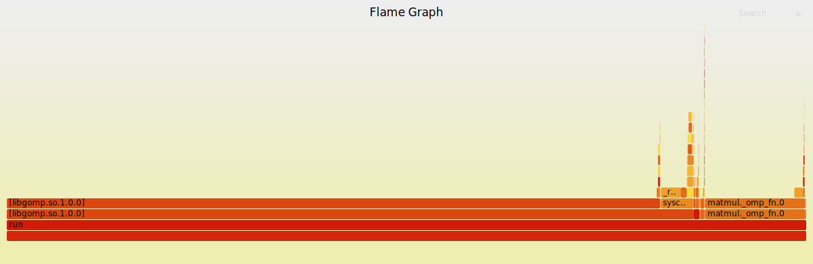
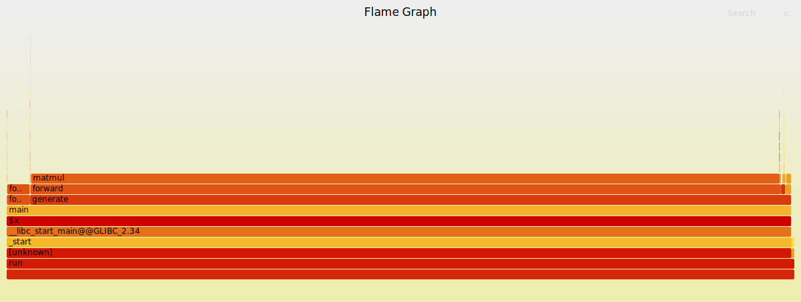

# Llama2 on Montecimone RISCV HPC System
This lab project merges two of the ideas that has been proposed in Lab of Big Data architectures course, which are LLMs and RISCV HPC performance characterization.

## Access to MonteCimone
First, let us access to our HPC system, called Montecimone, through ssh:
```bash 
ssh username@beta.dei.unibo.it -p 2223 
```
(you first need to request username and password)

After that we accessed in the login node, which is x86 architecture, while for RISCV nodes we will rely on Slurm system that manages accesses on all RISCV machines.

## Getting Llama2
Now we can clone Karpathy's repo to get his Llama2 model written in pure C language:
```bash 
git clone https://github.com/karpathy/llama2.c.git
cd llama2.c
```
Then, we get all his pretrained models:
```bash
wget https://huggingface.co/karpathy/tinyllamas/resolve/main/stories15M.bin
wget https://huggingface.co/karpathy/tinyllamas/resolve/main/stories42M.bin
wget https://huggingface.co/karpathy/tinyllamas/resolve/main/stories110M.bin
```

## Llama2 inference
Before compilation, we move to our RISCV machines through Slurm commands, like this ones:

For MILVS nodes (64 cores)
```bash 
srun -p mcimone-milkvs -t 00:05:00 --pty bash
```
For Sifive nodes (4 cores)

```bash 
srun -p mcimone-nodes -t 00:05:00 --pty bash
```

Now we can compile and play with Llama2:

```bash 
gcc -o run run.c -lm
./run stories15M.bin
```

(same reasoning for 42M and 110M)

In addition, we can prompt the model with some inputs, like:
```bash
./run stories42M.bin -t 0.8 -n 256 -i "One day, prof Andrea met superheroes"
```

## Analyzing the outcome
Karpathy has already provided a performance metric as output, which is token/seconds. Let us add and some compiler flags to speed it up:

-fopenmp for enabling parallelism and -O3 or -Ofast for optimizations:
```bash 
gcc -Ofast -fopenmp -o run run.c -lm
```
or

```bash 
gcc -O3 -fopenmp -o run run.c -lm
```

We run it on SIFIVE machines (4 cores) and achieved this:

| parameters |   flags                |  tok/s          |
| ------     |    -----               | -----           |
|   15M      |   -O3                  |  4.786056       |
|   15M      |   -O3 -fopenmp         |  16.980146      | 
|   15M      |   -Ofast               |  17.170330      |

| parameters |   flags                |  tok/s          |
| ------     |    -----               | -----           |
|   42M      |   -O3                  | 1.768644        | 
|   42M      |   -O3 -fopenmp         |      6.462453   |
|   42M      |   -Ofast               |   6.486090      | 
 
Running it on MILKV machines (64 cores) leads to better results:

| parameters |   flags                |  tok/s          |
| ------     |    -----               | -----           |
|   15M      |   -O3                  |  35.754347      |
|   15M      |   -O3 -fopenmp         |  158.385093     | 
|   15M      |   -Ofast               |  161.616162     |

| parameters |   flags                |  tok/s          |
| ------     |    -----               | -----           |
|   42M      |   -O3                  |    14.027087    | 
|   42M      |   -O3 -fopenmp         |   39.293380     |
|   42M      |   -Ofast               |   38.860104     | 

We collected all the outcomes and produced some graphs in plots.ipynb.

## Performance characterization

Let's go deeper into the analysis exploiting **perf** linux command.

Considering the 4-cores machine, perf record does not work, but we can have a general overview by using perf stat command:

```bash 
perf stat ./run stories15M.bin

```
15M model:

         72184.53 msec task-clock                       #   43.524 CPUs utilized
             30397      context-switches                 #  421.101 /sec
              2529      cpu-migrations                   #   35.035 /sec
             24465      page-faults                      #  338.923 /sec
      144465901074      cycles                           #    2.001 GHz
      145608923919      instructions                     #    1.01  insn per cycle
       63810539123      branches                         #  883.992 M/sec
          29783265      branch-misses                    #    0.05% of all branches


42M model:

         276901.74 msec task-clock                       #   38.314 CPUs utilized
             59777      context-switches                 #  215.878 /sec
              3773      cpu-migrations                   #   13.626 /sec
             15047      page-faults                      #   54.341 /sec
      554078618703      cycles                           #    2.001 GHz
      277443657680      instructions                     #    0.50  insn per cycle
      115283812388      branches                         #  416.335 M/sec
          65379291      branch-misses                    #    0.06% of all branches

for 110M:

        1238439.73 msec task-clock                       #   43.448 CPUs utilized
            131968      context-switches                 #  106.560 /sec
             10436      cpu-migrations                   #    8.427 /sec
            163081      page-faults                      #  131.683 /sec
     2478228009264      cycles                           #    2.001 GHz
      622737689937      instructions                     #    0.25  insn per cycle
      244484338098      branches                         #  197.413 M/sec
         146621514      branch-misses                    #    0.06% of all branches


For what about the 64-cores nodes, we can exploit perf record command, sampling the events we want as shown:

```bash 
perf record -g -e cycles -- ./run stories15M.bin
```

```bash 
perf record -g -e instructions -- ./run stories15M.bin
```

To read the outcome:

```bash 
perf report
```

## Profiling with Flamegraph
In addition, we can use the perf command to sample the stack of all processes and produce a flamegraph.

To do so, we clone Brendan Gregg's repo:
```bash 
git clone https://github.com/brendangregg/FlameGraph
```

then sample the stack:
```bash 
perf record -g -e cycles -- ./run stories15M.bin
```

collapse the stack with Brendan Gregg's scripts
```bash 
perf script | ../FlameGraph/stackcollapse-perf.pl > out.perf-folded
```
and produce the flamegprah
```bash 
../FlameGraph/flamegraph.pl out.perf-folded > perf.svg
```
Example 1:

A first example, where we run llama on all 64 cores:


Example 2:

A second one where instead we run llama on a single core:


