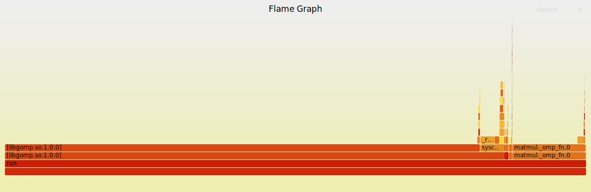

# Monte Cimone performance characterization project

## Llama2 compilation on MonteCimone 

### Set up

Firstly, to set up everything we need for the compilation, we all cloned Karpathy's repository as follows:

```bash 
git clone https://github.com/karpathy/llama2.c.git
```
and entered to llama2 folder
```bash 
cd llama2.c

```

From now on, each of us worked on a different model: I decided to work on the one with 260K parameters, Lorenza with 15M, Luca with 42M and Raffaele with 110M.

In my case, i got the 260K parameters model as follows:

```bash 
wget https://huggingface.co/karpathy/tinyllamas/resolve/main/stories260K/stories260K.bin
```

For the 15M model:

```bash 
wget https://huggingface.co/karpathy/tinyllamas/resolve/main/stories15M.bin
```
and so on for the others.


### Compilation:

This first part was straightforward, we just followed what was written in Karpathy's repo. To compile llama we moved from the login node to sifive or milkv nodes. Usually, this is done with the following command:

```bash 
srun -p mcimone-milkvs -t 00:05:00 --pty bash
```
For Sifive nodes instead:

```bash 
srun -p mcimone-nodes -t 00:05:00 --pty bash
```

For what concerns the compilation, we compiled llama with different compiler flags:

- -O3 flag: 

```bash 
gcc -O3 -o run run.c -lm
```

- -fopenmp for enabling parallelism:

```bash 
gcc -O3 -fopenmp -o run run.c -lm
```

- -Ofast for ruther optimization:

```bash 
gcc -O3 -Ofast -fopenmp -o run run.c -lm
```


Finally, we run the executable and collected the outocomes:


```bash 
./run stories260K.bin

```

To sum up, we collected everything in tables:

Sifives:

| parameters |   flags                |  tok/s          |
| ------     |    -----               | -----           |
|      260K  |   -O3                  | 301.775148      |
|    260k    |   -O3 -fopenmp         |      678.191489 |
|    260k    |   -Ofast               |    718.309859   |

| parameters |   flags                |  tok/s          |
| ------     |    -----               | -----           |
|   15M      |   -O3                  |  4.786056       |
|   15M      |   -O3 -fopenmp         |  16.980146      | 
|   15M      |   -Ofast               |  17.170330      |

| parameters |   flags                |  tok/s          |
| ------     |    -----               | -----           |
|   42M      |   -O3                  | 1.768644        | 
|   42M      |   -O3 -fopenmp         |      6.462453   |
|   42M      |   -Ofast               |   6.486090      | 

 
Milkvs:

| parameters |   flags                |  tok/s          |
| ------     |    -----               | -----           |
|   260K     |   -O3                  |    876.288660   |
|   260k     |   -O3 -fopenmp         |    508.547009   |
|   260k     |   -Ofast               |  580.865604     |

| parameters |   flags                |  tok/s          |
| ------     |    -----               | -----           |
|   15M      |   -O3                  |  35.754347      |
|   15M      |   -O3 -fopenmp         |  158.385093     | 
|   15M      |   -Ofast               |  161.616162     |

| parameters |   flags                |  tok/s          |
| ------     |    -----               | -----           |
|   42M      |   -O3                  |    14.027087    | 
|   42M      |   -O3 -fopenmp         |   39.293380     |
|   42M      |   -Ofast               |   38.860104     | 


## Performance characterization

### Perf stat
First perf command we tried is **perf stat**.

Considering Sifives, we run perf stat to all models and collected the outcomes:

```bash 
perf stat ./run stories15M.bin

```
15M model:

         72184.53 msec task-clock                       #   43.524 CPUs utilized
             30397      context-switches                 #  421.101 /sec
              2529      cpu-migrations                   #   35.035 /sec
             24465      page-faults                      #  338.923 /sec
      144465901074      cycles                           #    2.001 GHz
      145608923919      instructions                     #    1.01  insn per cycle
       63810539123      branches                         #  883.992 M/sec
          29783265      branch-misses                    #    0.05% of all branches


Same for 42M and 110M:

42M model:

         276901.74 msec task-clock                       #   38.314 CPUs utilized
             59777      context-switches                 #  215.878 /sec
              3773      cpu-migrations                   #   13.626 /sec
             15047      page-faults                      #   54.341 /sec
      554078618703      cycles                           #    2.001 GHz
      277443657680      instructions                     #    0.50  insn per cycle
      115283812388      branches                         #  416.335 M/sec
          65379291      branch-misses                    #    0.06% of all branches

for 110M:

        1238439.73 msec task-clock                       #   43.448 CPUs utilized
            131968      context-switches                 #  106.560 /sec
             10436      cpu-migrations                   #    8.427 /sec
            163081      page-faults                      #  131.683 /sec
     2478228009264      cycles                           #    2.001 GHz
      622737689937      instructions                     #    0.25  insn per cycle
      244484338098      branches                         #  197.413 M/sec
         146621514      branch-misses                    #    0.06% of all branches


### Perf record

Note: we coudln't execute perf record command on sifive nodes.

So far, we tried the following command:

```bash 

perf record -g -e cycles -- ./run stories15M.bin

```

```bash 

perf record -g -e instructions -- ./run stories15M.bin

```


Since we didn't enable the -g flag, we re-compiled the code as follows:


```bash 

gcc -g -O3 -fopenmp -o run run.c -lm

```

We applied the same reasoning for 42M and 110M models.


#### Flamegraph

to get a more readable output data, we proceeded as follows to represent the data as flamegraph:

```bash 

git clone https://github.com/brendangregg/FlameGraph

```
```bash 

perf record -g -e cycles -- ./run stories15M.bin

```

```bash 

perf script | ../FlameGraph/stackcollapse-perf.pl > out.perf-folded

```


```bash 

../FlameGraph/flamegraph.pl out.perf-folded > perf.svg

```
This is what we got so far:

